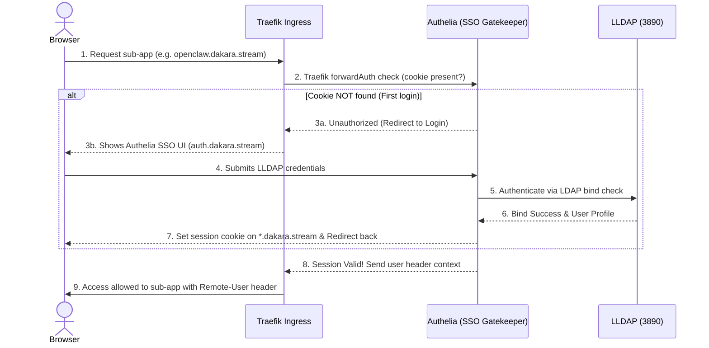

```meta-bind
INPUT[listSuggester(
	optionQuery(#task)
):depends_on]
```

```dataviewjs
const {update} = this.app.plugins.plugins["metaedit"].api;
const result = {result: {}};
await dv.view('_Assets/Scripts/dv-StatusCategoryUtils', result);
update('dependency_completion', `${result.result}%`, dv.current().file.path)
```
```dataviewjs
// 1. Get all tasks from the current page that are NOT completed
let tasks = dv.current().file.tasks.where(t => !t.completed);

// 2. Check if there are any tasks found
if (tasks.length > 0) {
    // Optional: Add a header so you know what this list is
    dv.header(3, "To Do");
    
    // 3. Render the list
    dv.taskList(tasks);
}
```
---

## Requirements

- **TrueNAS SCALE** version `TrueNAS-SCALE-25.10.1` and above (or generic Docker with Compose).
- Centralized storage app-pool configured on `ssd-data0` (specifically `/mnt/ssd-data0/app-data/authelia`).
- Preconfigured **LLDAP** setup (see [[write Docs v2 - lldap.md|write Docs v2 - lldap]]).
- Custom CLI deployment script `deploy_app.py` in the host home directory (`~/deploy_app.py`).

---

## 1. Architectural & SSO Integration Blueprint

Authelia serves as the central **Single Sign-On (SSO)** entry point and session gatekeeper for services under the `*.dakara.stream` domain namespace. It connects directly to LLDAP to validate user identity and generates secure wildcard cookies matching `.dakara.stream`. 

### 1.1 Ingress & Session Flow



### 1.2 Unprivileged Security Context
In compliance with our strict v2 container security standards:
- **No Root Privileges:** Standard user mapping runs the process under unprivileged UID/GID `568:568` (`apps:apps`).
- **Minimal Capabilities:** System capabilities are stripped entirely using `cap_drop: [ALL]`.
- **Privilege Escalation Blocked:** Container is configured with `privileged: false` and `security_opt: [no-new-privileges=true]`.

---

## 2. Installation & Setup

### 2.1 ZFS Dataset Creation
Create the isolated ZFS dataset on your `ssd-data0` pool to store configuration, session states, and local SQLite databases:

```sh
sudo zfs create \
  -o acltype=posixacl \
  -o xattr=sa \
  -o atime=off \
  -o compression=lz4 \
  "ssd-data0/app-data/authelia"

# Set ownership and permissions for the "apps" user and group (568:568)
sudo install -d -m 770 -o apps -g apps /mnt/ssd-data0/app-data/authelia
```

### 2.2 Secure Key Generation (1Password Vault)
Authelia requires three distinct, cryptographically strong secret keys (minimum 64 characters) to encrypt storage data, sign JWT tokens, and secure web session state. 

You can generate these keys in your shell:
```sh
tr -cd '[:alnum:]' < /dev/urandom | fold -w "64" | head -n 1
```

Save these values in your 1Password vault using the following secret URI mappings (using your clean space-free item name `lldap_authelia_helper` and direct field references to bypass CLI parsing limitations with spaces):
*   `op://Private/lldap_authelia_helper/JWT_SECRET`
*   `op://Private/lldap_authelia_helper/SESSION_SECRET`
*   `op://Private/lldap_authelia_helper/STORAGE_KEY`
*   `op://Private/lldap_authelia_helper/password` (dedicated LLDAP authelia_helper account password)

---

## 3. Configuration & Deployment

### 3.1 Configuration File (`configuration.yml`)
Write the Authelia configuration parameters. This maps directly to LLDAP user directory schema using the native `lldap` implementation, enables developer-friendly file notifier support for reset/2FA flows, and configures `.dakara.stream` root-domain session cookie settings.

Create and populate the configuration file:
```sh
sudo touch /mnt/ssd-data0/app-data/authelia/configuration.yml
sudo chmod 660 /mnt/ssd-data0/app-data/authelia/configuration.yml
sudo vim /mnt/ssd-data0/app-data/authelia/configuration.yml
```

Embed the following configurations:
![[configuration.yml]]

#### 3.1.1 1Password Secret Injection (`op inject`)
Instead of replacing the secret URIs manually, you can use the **1Password CLI (`op`)** to dynamically inject your vault secrets and write the production config file onto your server in a single step. 

> [!NOTE]
> `op inject` requires the `op://` URIs inside the configuration file template to be wrapped in double curly braces `{{ op://... }}` (which I have pre-configured in your `configuration.yml` template).

To run this cleanly in your terminal without multi-line copy-paste format issues, use this single-line command:

```sh
# 1. Run the secret injection locally to generate the populated environment config
op inject -f -i "configuration.yml" -o "configuration.env.yml"

# 3. Secure the permissions for the unprivileged apps:apps (568:568) user
sudo touch /mnt/ssd-data0/app-data/authelia/configuration.yml
sudo chown apps:apps /mnt/ssd-data0/app-data/authelia/configuration.yml
sudo chmod 660 /mnt/ssd-data0/app-data/authelia/configuration.yml
sudo vim /mnt/ssd-data0/app-data/authelia/configuration.yml
```

### 3.2 Deployment File (`authelia-deployment.yaml`)
Create the custom Docker Compose configuration structure:
```sh
sudo touch /mnt/ssd-data0/app-data/authelia/deployment.yaml
sudo chmod 660 /mnt/ssd-data0/app-data/authelia/deployment.yaml
sudo vim /mnt/ssd-data0/app-data/authelia/deployment.yaml
```

Embed the deployment file. It defines the unprivileged context, volumes, and Traefik labels containing the global `forwardAuth` middleware configuration:
![[authelia-deployment.yaml]]

### 3.3 Deploying to TrueNAS SCALE
Deploy the application and register its custom SSO gatekeeper icon in the TrueNAS Scale Apps Dashboard:

```sh
sudo ~/deploy_app.py authelia --file /mnt/ssd-data0/app-data/authelia/deployment.yaml --icon https://cdn.jsdelivr.net/gh/homarr-labs/dashboard-icons/png/authelia.png
```

---

## 4. Verification & Troubleshooting

### 4.1 Log Verification
Monitor the deployment logs inside TrueNAS or by running:
```sh
docker logs -f authelia
```
Confirm that:
1. Authelia successfully initialized and read `configuration.yml`.
2. Connection to LLDAP was successfully established on `ldap://192.168.0.21:3890`.
3. SQLite DB was created at `/config/db.sqlite3` with proper tables.

### 4.2 Auth Portal Access
Go to `https://auth.dakara.stream`. You should be presented with a modern, dark-themed login portal. Log in with your LLDAP username and password.

---

## 5. Integrating Services (SSO Protection)

To protect any backend application (e.g. OpenClaw) behind this central gatekeeper:
1. Ensure the app is connected to the same external `proxy` docker network.
2. In the app's Traefik routing labels, apply the global `authelia@docker` middleware:
   ```yaml
   traefik.http.routers.<app-name>.middlewares: "authelia@docker"
   ```
3. Enable header/trusted-proxy authentication in the backend application to read identity from the injected `Remote-User` header.
