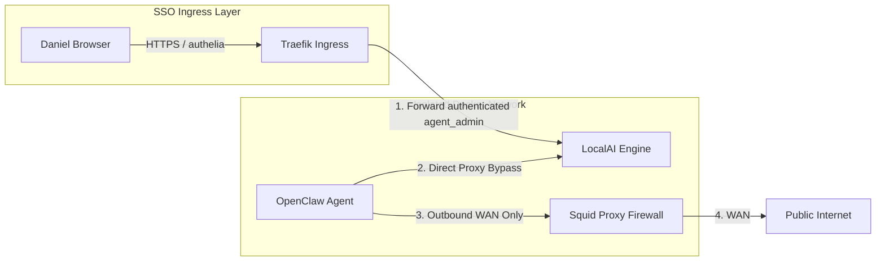

```meta-bind
INPUT[listSuggester(
	optionQuery(#task)
):depends_on]
```

```dataviewjs
const {update} = this.app.plugins.plugins["metaedit"].api;
const result = {result: {}};
await dv.view('_Assets/Scripts/dv-StatusCategoryUtils', result);
update('dependency_completion', `${result.result}%`, dv.current().file.path)
```
```dataviewjs
// 1. Get all tasks from the current page that are NOT completed
let tasks = dv.current().file.tasks.where(t => !t.completed);

// 2. Check if there are any tasks found
if (tasks.length > 0) {
    // Optional: Add a header so you know what this list is
    dv.header(3, "To Do");
    
    // 3. Render the list
    dv.taskList(tasks);
}
```
---

## Requirements

- **TrueNAS SCALE** version `TrueNAS-SCALE-25.10.1` and above (or generic Docker with Compose).
- Centralized storage app-pool configured on `ssd-data1` (specifically `ssd-data1/AI` dataset).
- Custom CLI deployment script `deploy_app.py` in the host home directory (`~/deploy_app.py`).

---

## 1. Architectural & Network Isolation Blueprint

To run a fully local, offline inference server securely, we deploy **LocalAI** as an isolated backend service. Keeping this distinct from the primary agent stack prevents unnecessary overhead and ensures model weights are kept permanently in-memory even when the agent configurations are reloaded.

### 1.1 Ingress Security & Role-Based Access Control (SSO)
*   **Secure Ingress (`https://localai.dakara.stream`):** Traefik exposes the LocalAI API/WebUI securely over SSL, terminated at the ingress proxy layer.
*   **Group Authorization (Authelia RBAC):** Access is gated globally via the `authelia@docker` middleware. In Authelia's `configuration.yml` under `access_control`, we enforce a strict rule requiring that authenticated users **must belong to the `agent_admin` LDAP group** (`group:agent_admin`) to gain dashboard or API entry.
*   **Private Sandbox Communication:** While humans connect securely via Traefik SSO on port `443`, OpenClaw connects internally directly to LocalAI over the private Docker `proxy` network on port `30286` (bypassing the public ingress entirely).

### 1.2 Docker Compose Architecture & Communication Flow



### 1.3 Unprivileged Security Context
In compliance with our strict v2 container security standards:
- **No Root Privileges:** Standard user mapping runs the process under unprivileged UID/GID `568:568` (`apps:apps`).
- **Minimal Capabilities:** System capabilities are stripped entirely using `cap_drop: [ALL]`.
- **Privilege Escalation Blocked:** Container is configured with `privileged: false` and `security_opt: [no-new-privileges=true]`.
- **Resource Constraints:** Heavy inference can saturate resources, so we cap CPU execution to `6` cores and memory to `8192M`.

---

## 2. Installation & Setup

### 2.1 ZFS Dataset Creation
Create isolated ZFS datasets on your `ssd-data1` pool. This segregates model configurations, heavy `.gguf` weights, and custom backends:

```sh
sudo zfs create "ssd-data1/AI/localai"
sudo zfs create "ssd-data1/AI/localai/config"
sudo zfs create "ssd-data1/AI/localai/models"

# Set ownership and permissions for the "apps" user and group (568:568)
sudo install -d -m 770 -o apps -g apps \
  /mnt/ssd-data1/AI/localai \
  /mnt/ssd-data1/AI/localai/config \
  /mnt/ssd-data1/AI/localai/models
```

### 2.2 Compose File Configuration
Create and secure the Compose definition file on your TrueNAS server:

```sh
sudo touch /mnt/ssd-data1/AI/localai-deployment.yaml
sudo chmod 660 /mnt/ssd-data1/AI/localai-deployment.yaml
sudo vim /mnt/ssd-data1/AI/localai-deployment.yaml
```

Embed the following configurations:
![[localai-deployment.yaml]]

### 2.3 Deploying to TrueNAS SCALE
Deploy the application and register its custom web interface icon:

```sh
sudo ~/deploy_app.py localai --file /mnt/ssd-data1/AI/localai-deployment.yaml --icon https://cdn.jsdelivr.net/gh/selfhst/icons/png/localai.png
```

---

## 3. Integrating with OpenClaw

To prevent OpenClaw's Squid proxy firewall from blocking LAN queries to the LocalAI container, verify that your OpenClaw deployment environment has the custom bypass variables in its `NO_PROXY` parameters (this is pre-configured in Phase 2):

```yaml
    environment:
      # ...
      NO_PROXY: localhost,127.0.0.1,config,localai
      no_proxy: localhost,127.0.0.1,config,localai
```

### 3.1 Custom Provider Mapping in OpenClaw
1. Access your OpenClaw Control UI at `https://openclaw.dakara.stream`.
2. Go to **Settings** $\rightarrow$ **AI Providers**.
3. Add a new **Custom Provider**:
   * **Provider Type:** `openai-completions`
   * **Base URL:** `http://localai:30286/v1`
   * **API Key:** `local` (any arbitrary string satisfies the client library)
4. Confirm model detection and load your `.gguf` weights directly!
