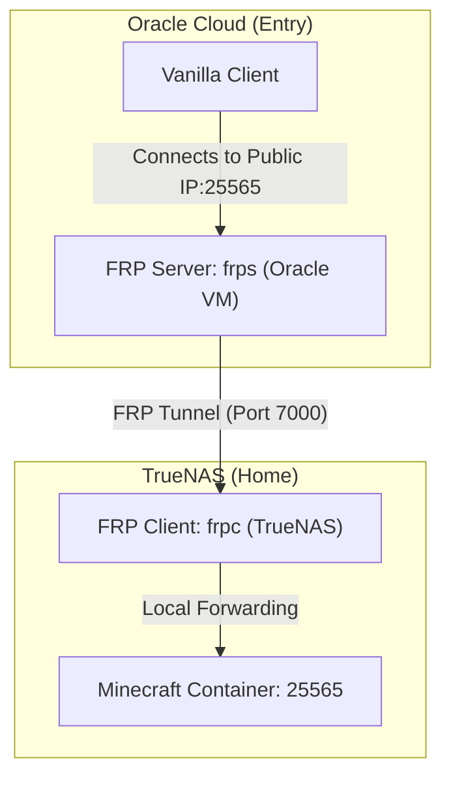

```meta-bind
INPUT[listSuggester(
	optionQuery(#task)
):depends_on]
```

```dataviewjs
const {update} = this.app.plugins.plugins["metaedit"].api;
const result = {result: {}};
await dv.view('_Assets/Scripts/dv-StatusCategoryUtils', result);
update('dependency_completion', `${result.result}%`, dv.current().file.path)
```
```dataviewjs
// 1. Get all tasks from the current page that are NOT completed
let tasks = dv.current().file.tasks.where(t => !t.completed);

// 2. Check if there are any tasks found
if (tasks.length > 0) {
    // Optional: Add a header so you know what this list is
    dv.header(3, "To Do");
    
    // 3. Render the list
    dv.taskList(tasks);
}
```
---

# Oracle Cloud Free VM to Home Tunnel Setup (FRP)

This document provides the complete architecture and step-by-step implementation for tunneling traffic from the public internet into the local **Dakara SmartHome** network through a free **Oracle Cloud Infrastructure (OCI)** VM, punching through **CGNAT** without client-side configuration.

## 🏗️ Architecture: Why FRP?

We selected **FRP (Fast Reverse Proxy)** over Netbird + `socat` for the following reasons:
1. **Ultra-Lightweight:** FRP is a single binary written in Go. No mesh VPN overlay overhead or virtualization drivers needed.
2. **Standard Docker Setup:** The client (`frpc`) runs inside a standard TrueNAS Scale Docker Compose app without special network capabilities (`CAP_NET_ADMIN`) or WireGuard kernel dependency.
3. **Explicit Port Mappings:** Ports are routed directly in a single `frpc.toml` configuration, making external pathways highly visible and audit-friendly.
4. **Zero-Client config:** Players connect directly using the Oracle VM's static IP/DNS without needing any VPN or client utility.




---

## 🖥️ Step 1: Provisioning the OCI VM Instance

These are the verified specifications for the Always-Free Oracle Cloud Infrastructure (OCI) VM instance based on your console configuration:

### 📋 VM Instance Specifications
*   **Name:** `home1912.dakara.stream` (matches your `*.dakara.stream` domain structure)
*   **Compartment:** `devdanielknourek (root)`
*   **Placement (Availability Domain):** `AD 3` (`ptih:EU-FRANKFURT-1-AD-3` located in the **Frankfurt** region)
*   **Shape:** `VM.Standard.E2.1.Micro` (Always Free-eligible)
*   **Allocated Shape Resources:**
    *   **OCPU Count:** 1 core OCPU
    *   **Memory (RAM):** 1 GB
    *   **Network Bandwidth:** 0.48 Gbps
*   **Operating System:** `Canonical Ubuntu 24.04 Minimal` (AMD x86_64)
*   **Boot Volume & Storage:** Default size (46.6 GB), In-Transit Encryption: `ON`, KMS Keys: `OFF` (Oracle-managed keys)
*   **Security Settings:** Shielded VM: `OFF`, Confidential Computing: `OFF` (Disabled for standard compatibility)
*   **Networking Details:**
    *   **VCN:** `vcn-dakara-tunnel` (New VCN)
    *   **Subnet:** `subnet-dakara-tunnel` (New Public Subnet, CIDR: `10.0.0.0/24`)
    *   **VNIC Name:** `vnic-dakara-tunnel`
*   **SSH Key Management:**
    *   **Private Key Storage:** 1Password (`op://Private/vnic-dakara-tunnel/private key`)

> [!TIP]
> **✓ Operating System, Security, Network & Storage Selection:**
> *   **OS:** We selected **Canonical Ubuntu 24.04 Minimal** (AMD x86_64 architecture).
> *   **Shape:** Configured with the **VM.Standard.E2.1.Micro** Always-Free shape due to the high-demand capacity limits of the ARM A1.Flex shape in Frankfurt. It provides 1 OCPU and 1 GB of RAM, which is more than enough for a dedicated FRP tunnel.
> *   **Security Settings:** Kept all Shielded VM and Confidential Computing options **OFF**. Leaving shielded boot options disabled ensures standard Docker, kernel modules, and networking packages load smoothly without firmware-level blocks.
> *   **Networking:** Configured a brand new Virtual Cloud Network (`vcn-dakara-tunnel`) and public subnet (`subnet-dakara-tunnel`) to isolate the tunnel environment.
> *   **Secrets:** Private keys successfully secured in your **1Password** vault under `op://Private/vnic-dakara-tunnel/private key`.
> *   **Storage:** Kept default boot volume storage configurations (46.6 GB size with standard Oracle-managed keys and active in-transit encryption). Fits perfectly within the 200 GB Always Free tier limits.

> [!WARNING]
> **⚠️ OCI Console Bug - Missing Public IP Troubleshooting:**
> Due to a known Oracle Cloud interface validation bug, selecting "Create new VCN" might force the **"Automatically assign public IPv4 address"** toggle to `OFF` (greyed out), resulting in a VM provisioned with only a private IP.
>
> **How to manually assign a Public IP (Post-Creation):**
> 1. Open the VM Details page and click the **`Networking`** tab.
> 2. Scroll to the **`Attached VNICs`** table and click on your primary VNIC (**`vnic-dakara-tunnel`**).
> 3. Click the **`IP administration`** tab at the top.
> 4. Click the **three dots menu (`...`)** on the far right of your private IP (`10.0.0.157`) and select **`Edit`**.
> 5. Select **`Ephemeral public IP`**, name it `publicIP-dakara-tunnel`, and click **`Update`**.

---

## ☁️ Step 2: OCI Network & Firewall Setup (Oracle Dashboard)

Oracle Cloud VMs are protected by **both** an outer Cloud Security List (firewall) and host-level rules (like `iptables`/`ufw`). You must open ports in both places.

### 1. Ingress Rules in Oracle Console
Go to: **Compute** -> **Instances** -> Click your Instance -> Click your **Virtual Cloud Network** link -> Click the **`Security`** tab -> Click **`Default Security List for vcn-dakara-tunnel`**.

Add the following **Ingress Rules** (Source CIDR: `0.0.0.0/0`):
*   **FRP Control Port (TCP):** `7000` (Needed for client-server link)
*   **FRP Dashboard (TCP):** `7500` (Optional - status dashboard)
*   **Minecraft Java (TCP):** `25565`

---

## 🐧 Step 3: Configure Oracle Cloud VM (FRP Server)

We run `frps` via Docker Compose on the Oracle VM for easy maintenance and zero host clutter.

### 1. SSH into the VM

To connect to your Oracle VM using Termius or a standard terminal, configure the connection with these parameters:
*   **Host/IP:** `YOUR_ORACLE_VM_PUBLIC_IP`
*   **Port:** `22`
*   **Username:** `ubuntu` *(Default for official Ubuntu images on Oracle Cloud)*
*   **Key File:** Your downloaded private SSH key (`op://Private/vnic-dakara-tunnel/private key`)

---

### 2. VM Pre-Requisites & Packages (Install Docker, Vim, UFW)

Since you installed the **Ubuntu Minimal** image, essential packages like Vim, Docker, and UFW are not pre-installed. Run these commands to get your VM ready:

#### A. Update System Packages
```sh
sudo apt update && sudo apt upgrade -y
```

#### B. Install Text Editors & Utilities
```sh
sudo apt install -y vim nano curl git ca-certificates
```

#### C. Install Docker Engine & Compose Plugin
```sh
# Add Docker's official GPG key
sudo install -m 0755 -d /etc/apt/keyrings
sudo curl -fsSL https://download.docker.com/linux/ubuntu/gpg -o /etc/apt/keyrings/docker.asc
sudo chmod a+r /etc/apt/keyrings/docker.asc

# Add the repository to Apt sources
echo \
  "deb [arch=$(dpkg --print-architecture) signed-by=/etc/apt/keyrings/docker.asc] https://download.docker.com/linux/ubuntu \
  $(. /etc/os-release && echo "$VERSION_CODENAME") stable" | \
  sudo tee /etc/apt/sources.list.d/docker.list > /dev/null
sudo apt update

# Install Docker packages
sudo apt install -y docker-ce docker-ce-cli containerd.io docker-buildx-plugin docker-compose-plugin

# Enable and start Docker service
sudo systemctl enable --now docker

# Add your user to the docker group (allows running docker without sudo)
sudo usermod -aG docker ubuntu
```
> [!NOTE]
> Log out of SSH and log back in for the `docker` group membership to take effect!

#### D. Install & Configure UFW Host Firewall
```sh
# Install UFW
sudo apt install -y ufw

# Set default firewall policies
sudo ufw default deny incoming
sudo ufw default allow outgoing

# CRITICAL: Allow SSH connections before enabling the firewall to prevent lockout
sudo ufw allow 22/tcp

# Enable the firewall
sudo ufw enable
```

---

### 3. Create Directories & Config Files

Once your pre-requisites are installed and you have re-logged in, create the application directory:
```sh
mkdir -p ~/frp
cd ~/frp
```

Create the server config `frps.toml`:
```toml
# vim  ~/frp/frps.toml
bindPort = 7000

# Security token to prevent unauthorized clients from connecting
auth.method = "token"
auth.token = "op://Private/home1912.dakara.stream ORACLE/FRPS tunnel/auth.token"

# FRP Web Dashboard (To monitor active tunnels)
webServer.addr = "0.0.0.0"
webServer.port = 7500
webServer.user = "admin"
webServer.password = "op://Private/home1912.dakara.stream ORACLE/FRPS tunnel/webServer.password"
```

### 4. Create the Docker Compose file

Create `docker-compose.yml` on the Oracle VM:
```yaml
# vim ~/frp/docker-compose.yml
version: '3.8'
services:
  frps:
    image: fatedier/frps:v0.58.1
    container_name: frps
    restart: unless-stopped
    volumes:
      - ./frps.toml:/etc/frp/frps.toml
    ports:
      - "7000:7000"
      - "7500:7500"
      - "25565:25565"
    command: -c /etc/frp/frpc.toml
```

### 5. Open VM Host Firewall

Now that UFW is active, open the ports required for FRP and Minecraft connections:
```sh
# Open FRP ports
sudo ufw allow 7000/tcp
sudo ufw allow 7500/tcp
sudo ufw allow 25565/tcp

# Alternative (if UFW is not active, standard OCI Ubuntu uses iptables-persistent):
sudo iptables -I INPUT 6 -p tcp --dport 7000 -j ACCEPT
sudo iptables -I INPUT 6 -p tcp --dport 7500 -j ACCEPT
sudo iptables -I INPUT 6 -p tcp --dport 25565 -j ACCEPT
sudo netfilter-persistent save
```

### 6. Start FRP Server

Launch the container in background mode:
```sh
docker compose up -d
```
Verify the server is running by viewing logs: `docker compose logs -f`

---

## 🏠 Step 4: Configure TrueNAS Scale (FRP Client)

Following the **Dakara SmartHome v2** infrastructure standard, we centralize app data in `/mnt/ssd-data0/app-data/` and deploy via the `deploy_app.sh` script.

### 1. Initialize ZFS App Dataset
SSH into your TrueNAS Scale host and execute:
```sh
sudo zfs create \
  -o acltype=posixacl \
  -o xattr=sa \
  -o atime=off \
  -o compression=lz4 \
  "ssd-data0/app-data/frp"
```

### 2. Create Configuration Files
Create the client config `frpc.toml` on the TrueNAS host:
```sh
sudo touch /mnt/ssd-data0/app-data/frp/frpc.toml
sudo chmod 600 /mnt/ssd-data0/app-data/frp/frpc.toml

# lazy person snippet
sudo vim /mnt/ssd-data0/app-data/frp/frpc.toml
```

Edit `/mnt/ssd-data0/app-data/frp/frpc.toml` and add:
```toml
# /mnt/ssd-data0/app-data/frp/frpc.toml
serverAddr = "op://Private/home1912.dakara.stream ORACLE/adress"
serverPort = 7000

auth.method = "token"
auth.token = "op://Private/home1912.dakara.stream ORACLE/FRPS tunnel/auth.token"

[[proxies]]
name = "minecraft-java"
type = "tcp"
localIP = "192.168.0.21" # Host/bond0 IP where Minecraft container exposes port 25565
localPort = 25565
remotePort = 25565
```
> [!NOTE]
> Ensure the `serverAddr` matches your Oracle VM public IP, and the `auth.token` matches your `frps.toml` exactly.

### 3. Create Deployment File
Create the TrueNAS-compatible Docker Compose file:
```sh
sudo touch /mnt/ssd-data0/app-data/frp/deployment.yaml
sudo chmod 600 /mnt/ssd-data0/app-data/frp/deployment.yaml

# lazy person snippet
sudo vim /mnt/ssd-data0/app-data/frp/deployment.yaml
```

Edit `/mnt/ssd-data0/app-data/frp/deployment.yaml` and add:
```yaml
# /mnt/ssd-data0/app-data/frp/deployment.yaml
version: "3.9"
services:
  frpc:
    image: fatedier/frpc:v0.58.1
    container_name: frpc
    restart: unless-stopped
    volumes:
      - "/mnt/ssd-data0/app-data/frp/frpc.toml:/etc/frp/frpc.toml"
    network_mode: "host"
    command: -c /etc/frp/frpc.toml

# --- TrueNAS Metadata Extensions ---
x-notes: >
  ## FRP Client Tunnel
  **Status:** Custom Configuration  
  
  Tunnels local services (like Minecraft) to the public Oracle Cloud VM.
  Managed via external custom app deployment script.
```

### 4. Deploy FRP Client
Deploy the client as a custom app using the automated script:
```sh
sudo ~/deploy_app.py frpc-oracle --file /mnt/ssd-data0/app-data/frp/deployment.yaml --icon https://cdn.jsdelivr.net/gh/homarr-labs/dashboard-icons/png/frp.png
```

---

## 🔍 Step 5: Verification & Troubleshooting

1.  **Check FRP Client Logs (on TrueNAS):**
    ```sh
    docker logs -f frpc
    ```
    You should see lines indicating a successful connection to the server and the registration of proxies `[minecraft-java]` and `[minecraft-bedrock]`.

2.  **Access the FRP Dashboard:**
    Open `http://YOUR_ORACLE_VM_PUBLIC_IP:7500` in your web browser and login with your configured credentials. You will see real-time statistics and active proxy connections.

3.  **Test connection:**
    Launch Minecraft and connect directly to `YOUR_ORACLE_VM_PUBLIC_IP:25565`. Players should connect instantly without lag or client configurations.
