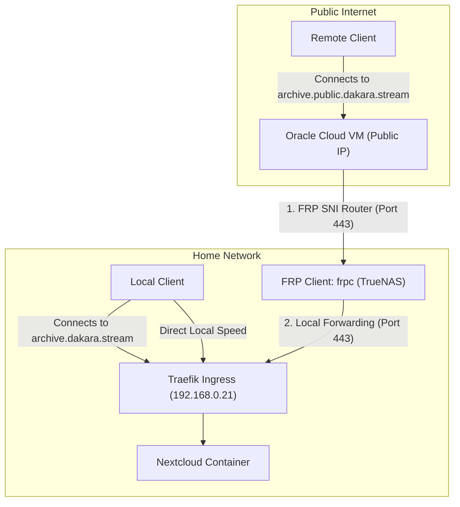

# Exposing Selected Services Publicly (FRP Tunnel + Dual-Host Routing)

This document provides step-by-step instructions for setting up public access to your local services (like Jellyfin and Nextcloud) using the Oracle Cloud Infrastructure (OCI) VM as a public entrypoint, while preserving direct local network speeds when accessing them from home.

> [!NOTE]
> This tunnel configuration has been updated to also route game traffic for the **Factorio Server** (UDP `25520`). For setup details, see [[Dakara Tasks/write Docs v2 - Factorio server/write Docs v2 - Factorio server.md|write Docs v2 - Factorio server]].

---

## 🏗️ Architecture Flow



---

## 📋 Checklist & Tasks

- [x] **Step 1: Cloudflare DNS Setup**
- [x] **Step 2: Oracle VM Configuration (FRP Server)**
- [x] **Step 3: TrueNAS Scale Configuration (FRP Client)**
- [x] **Step 4: Traefik Dual-Host Routing Configurations**
- [ ] **Step 5: Nextcloud System Trusted Domains Override**
- [ ] **Step 6: Verification**

---

## 🛠️ Step-by-Step Implementation

### Step 1: Cloudflare DNS Setup

Rather than configuring DNS records for each individual service, set up wildcard (catch-all) records in your Cloudflare DNS manager:

1.  **Local Wildcard:** Resolves all standard subdomains to your local TrueNAS Scale IP when resolving inside the network (they will only load when connected to your home network).
    *   **Type:** `A` | **Name:** `*.dakara.stream` | **Value:** `192.168.0.21` | **Proxy:** `DNS Only (Grey Cloud)`
2.  **Public Gateway:** Point the public base subdomain to your OCI VM.
    *   **Type:** `A` | **Name:** `public.dakara.stream` | **Value:** `79.76.118.187` | **Proxy:** `DNS Only (Grey Cloud)`
3.  **Public Wildcard (CNAME Catch-All):** Directs all public sub-services to your public gateway.
    *   **Type:** `CNAME` | **Name:** `*.public.dakara.stream` | **Value:** `public.dakara.stream` | **Proxy:** `DNS Only (Grey Cloud)`

---

### Step 2: Oracle VM Configuration (FRP Server)

SSH into your Oracle VM instance (`ubuntu@79.76.118.187`) and perform these updates:

1.  **Update `frps.toml` Config:**
    Open the server config
    Add `vhostHttpsPort = 443` to enable HTTPS SNI-routing:    
```toml
// vim ~/frp/frps.toml
bindPort = 7000
vhostHttpsPort = 443
```
    
2.  **Update `docker-compose.yml` Config:**
    Open the Docker file
    Map port `443` on the host to the container:    
```yaml
// vim ~/frp/docker-compose.yml
version: '3.8'
services:
  frps:
    image: fatedier/frps:v0.58.1
    container_name: frps
    restart: unless-stopped
    volumes:
      - ./frps.toml:/etc/frp/frps.toml
    ports:
      - "7000:7000"
      - "443:443"
      - "25565:25565" # Minecraft
      - "25520:25520/udp" # Factorio Game (UDP)
```
    
3.  **Open VM Host Firewall (UFW) & OCI Security List:**
    On the VM CLI, open port 443:    
```sh
sudo ufw allow 443/tcp
```
    
> [!IMPORTANT]
> **Configure the OCI Security List in the Oracle Console:**
> 1. In the **OCI Console**, open the main navigation menu (top-left hamburger button) and go to **Networking** -> **Virtual Cloud Networks**.
> 2. Click on your VCN link: **`vcn-dakara-tunnel`**.
> 3. In the left-hand sidebar, under **Resources**, click on **Security Lists**.
> 4. Click on the default security list: **`Default Security List for vcn-dakara-tunnel`**.
> 5. Click the **Add Ingress Rules** button.
> 6. Fill in the ingress rule options:
>    * **Source Type:** `CIDR`
>    * **Source CIDR:** `0.0.0.0/0` (Allows public internet access)
>    * **IP Protocol:** `TCP`
>    * **Source Port Range:** (Leave empty for All)
>    * **Destination Port Range:** `443`
>    * **Description:** `FRP Public HTTPS Ingress (SNI Routing)`
> 7. Click the **Add Ingress Rules** button to apply the change.
    
    
4.  **Restart FRP Server:**
```sh
cd ~/frp
docker compose down && docker compose up -d
```

---

### Step 3: TrueNAS Scale Configuration (FRP Client)

Configure your local client to tunnel traffic for the new public subdomains:

1.  **Update Client Config [[Dakara Tasks/write Docs v2 - public access/frpc.toml|frpc.toml]]:**
    Instead of editing the configuration manually with secrets, you can use the **1Password CLI (`op`)** to dynamically inject your vault secrets and write the production config file onto your server:
```sh
# 1. Run the secret injection (change directory and generate populated config in one line)
cd "Dakara Tasks/write Docs v2 - public access" && op inject -f -i "frpc.toml" -o "frpc.secret.toml"

# 2. Copy to the FRP config path and secure permissions for the apps:apps (568:568) user
sudo mkdir -p /mnt/ssd-data0/app-data/frp
sudo cp frpc.secret.toml /mnt/ssd-data0/app-data/frp/frpc.toml
sudo chmod 660 /mnt/ssd-data0/app-data/frp/frpc.toml
sudo chown apps:apps /mnt/ssd-data0/app-data/frp/frpc.toml
```
    *(Alternatively, you can edit it manually with `sudo vim /mnt/ssd-data0/app-data/frp/frpc.toml` if needed).*

	Add HTTPS SNI routing rules for your public-facing apps. You have two ways to configure this:

#### Method A: Wildcard Forwarding (Recommended for Ease of Use)
This forwards **all** subdomains under `*.public.dakara.stream` to your home Traefik. Traefik will decide what is allowed and what gets a 404.
* **Advantage:** You never have to modify `frpc.toml` or restart `frpc` again when adding new public services.
```toml
serverAddr = "79.76.118.187"
serverPort = 7000
auth.method = "token"
auth.token = "YOUR_FRP_SECRET_TOKEN"

[[proxies]]
name = "minecraft-java"
type = "tcp"
localIP = "192.168.0.21"
localPort = 25565
remotePort = 25565

[[proxies]]
name = "factorio-game"
type = "udp"
localIP = "192.168.0.21"
localPort = 25520
remotePort = 25520

[[proxies]]
name = "public-web-wildcard"
type = "https"
customDomains = ["*.public.dakara.stream"]
localIP = "192.168.0.21"
localPort = 443
```

#### Method B: Explicit Whitelisting (Recommended for Security)
This explicitly defines each public subdomain.
* **Advantage:** Maximum security. Unwanted domains (like `lldap.public.dakara.stream` or random scans) are dropped directly at the Oracle VM and never consume your home internet connection.
* **Disadvantage:** You must add a new block here and restart `frpc` every time you expose a new app.
```toml
serverAddr = "79.76.118.187"
serverPort = 7000
auth.method = "token"
auth.token = "YOUR_FRP_SECRET_TOKEN"

[[proxies]]
name = "minecraft-java"
type = "tcp"
localIP = "192.168.0.21"
localPort = 25565
remotePort = 25565

[[proxies]]
name = "factorio-game"
type = "udp"
localIP = "192.168.0.21"
localPort = 25520
remotePort = 25520

[[proxies]]
name = "public-jellyfin"
type = "https"
customDomains = ["kino.public.dakara.stream"]
localIP = "192.168.0.21"
localPort = 443

[[proxies]]
name = "public-nextcloud"
type = "https"
customDomains = ["archive.public.dakara.stream"]
localIP = "192.168.0.21"
localPort = 443

[[proxies]]
name = "public-jellyseerr"
type = "https"
customDomains = ["program.public.dakara.stream"]
localIP = "192.168.0.21"
localPort = 443

[[proxies]]
name = "public-authelia"
type = "https"
customDomains = ["auth.public.dakara.stream"]
localIP = "192.168.0.21"
localPort = 443
```

2.  **Restart the FRP Client:**
```sh
docker restart frpc
```

---

### Step 4: Traefik Dual-Host Routing Configurations

Now, update your home applications to respond to **both** their local address and their new public address.

1.  **Update Nextcloud Configuration:**
Open the deployment configuration file for Nextcloud (e.g., `nextcloud-deployment.yaml`):
```sh
sudo vim /mnt/ssd-data0/app-data/nextcloud/deployment.yaml
```
Modify the Traefik router rule label to accept both domains:
```yaml
- traefik.http.routers.nextcloud.rule: "Host(`archive.dakara.stream`) || Host(`archive.public.dakara.stream`)"
- traefik.http.routers.nextcloud-whiteboard.rule: "Host(`whiteboard.dakara.stream`) || Host(`whiteboard.public.dakara.stream`)"
```
    
2.  **Update Jellyfin Configuration:**
Open the deployment configuration file for Jellyfin (e.g., `jellyfin-deployment.yaml`):
```sh
sudo vim /mnt/ssd-data0/app-data/jellyfin/deployment.yaml
```
Modify the Traefik router rule label:
```yaml
- traefik.http.routers.jellyfin.rule: "Host(`kino.dakara.stream`) || Host(`kino.public.dakara.stream`)"
```
    
3.  **Update Jellyseerr Configuration:**
Open the deployment configuration file for Jellyseerr (e.g., `jellyfin-addons-deployment.yaml`):
```sh
sudo vim /mnt/ssd-data0/app-data/jellyfin/jellyfin-addons-deployment.yaml
```
Modify the Jellyseerr router rule label:
```yaml
- traefik.http.routers.jellyseerr.rule: "Host(`program.dakara.stream`)|| Host(`program.public.dakara.stream`) || Host(`jellyseerr.dakara.stream`)"
```
    
4.  **Update Authelia Configuration:**
Open the deployment configuration file for Authelia (e.g., `authelia-deployment.yaml`):
```sh
sudo vim /mnt/ssd-data0/app-data/authelia/deployment.yaml
```
Modify the Authelia router rule label:
```yaml
- traefik.http.routers.authelia.rule: "Host(`auth.dakara.stream`) || Host(`auth.public.dakara.stream`)"
```

5.  **Re-deploy the Apps:**
Use your custom app script to refresh/re-deploy the containers:
```sh
sudo ~/deploy_app.py nextcloud --file /mnt/ssd-data0/app-data/nextcloud/deployment.yaml
sudo ~/deploy_app.py jellyfin --file /mnt/ssd-data0/app-data/jellyfin/deployment.yaml
sudo ~/deploy_app.py jellyfin-addons --file /mnt/ssd-data0/app-data/jellyfin/jellyfin-addons-deployment.yaml
sudo ~/deploy_app.py authelia --file /mnt/ssd-data0/app-data/authelia/deployment.yaml
```

*Traefik will detect the new rules and automatically generate SSL certificates for the `.public.` subdomains via its Cloudflare DNS-01 resolver.*

---

### Step 5: Nextcloud System Trusted Domains Override

Nextcloud strictly validates incoming request Host headers. You must whitelist `archive.public.dakara.stream` in Nextcloud's configuration to prevent "Access through untrusted domain" errors.

1.  **Add Domain via OCC Command:**
First, view your existing trusted domains to find the next available index:
```sh
# Exec into your Nextcloud container (e.g., ix-nextcloud-nextcloud-1)
php occ config:system:get trusted_domains
```
This will list your current trusted domains in order (0-indexed). Count them to find the next free index. For example, if you see 5 domains (indices 0 to 4), your next free index is **5**.

Run the command using that next index to append the public domain safely:
```sh
php occ config:system:set trusted_domains 5 --value="archive.public.dakara.stream"
```

> [!WARNING]
> If you accidentally ran the command with index `2` and overwrote `archive.dakara.stream`, run these two commands to restore it and append the public domain correctly:
> ```sh
> # Restore the local domain at index 2
> php occ config:system:set trusted_domains 2 --value="archive.dakara.stream"
> 
> # Append the public domain at index 5 (or the next free index)
> php occ config:system:set trusted_domains 5 --value="archive.public.dakara.stream"
> ```

2.  **Alternative (Direct File Edit):**
If the above command fails, edit `config.php` directly:
```sh
sudo nano /mnt/ssd-data0/app-data/nextcloud/config/config.php
```
Locate the `trusted_domains` array and append the public address:
```php
  'trusted_domains' => 
  array (
    0 => '192.168.0.21',
    1 => 'archive.dakara.stream',
    2 => 'archive.public.dakara.stream',
  ),
```

---

### Step 6: Verification

Execute these manual checks to verify your setup:

1.  **Local Access Test:**
    *   On home Wi-Fi, go to `https://archive.dakara.stream` and verify connection speed. It should be instant (direct LAN connection).
2.  **Public Access Test:**
    *   Disable Wi-Fi on a mobile phone (use cellular data) and load `https://archive.public.dakara.stream` and `https://kino.public.dakara.stream`. Verify the SSL certificate is valid and services load correctly.
3.  **Security Filtering Test:**
    *   From cellular data, attempt to connect to `https://lldap.public.dakara.stream`. The connection should be refused or timed out at the Oracle Cloud layer, proving that unauthorized services are completely blocked at the edge.
